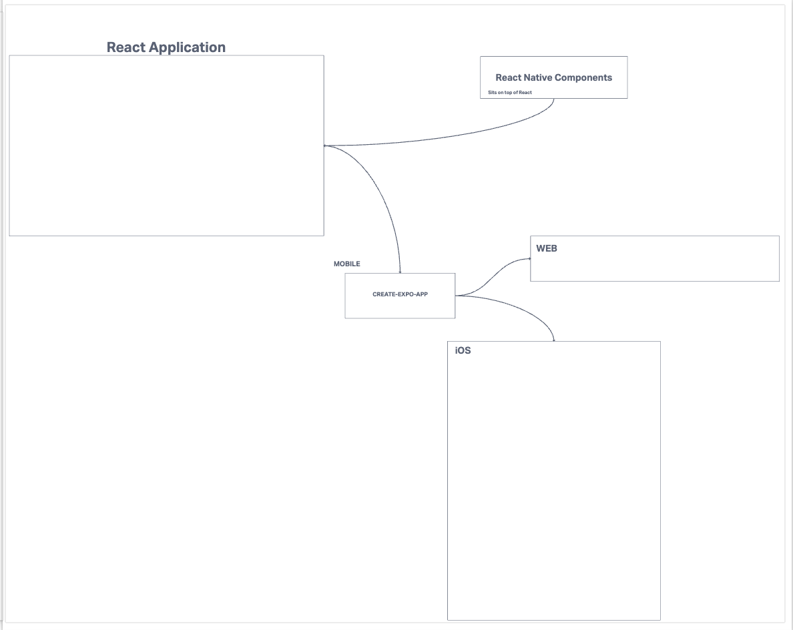

# LAB 41 - Phone-App

Author: Adrienne Frey

## Problem Domain/Features:

   Create your first native phone/device application using React Native, tapping into at least 2 phone features.
   
   Phase 1:

    Use at least 1 native device feature (Contacts, Camera, GPS, etc)

    Milestone 1 - MVP (This Lab)
   
    Deliver your MVP for raw functionality
    Your dev environment should be properly working
    Other users should be able to scan your QR and see your app on any device
    All of your core “features” should be working properly
    Un-Styled is fine. We’re looking for things to buzz, light up, detect movement, etc.

    Phase 2:
    
    As you complete your RNA, switch your focus to the user experience.

    Milestone 2 - Product Delivery (This Lab)

    Quality and Thoughtful Styling using css-in-js
    Right sized tap targets, good contrast
    Dark and Light Modes
    Well thought through UX
    Be considerate of individuals that primarily use their thumbs, left or right hands
  
### How to initialize/run application

    1. Clone down the repo to local machine 
    2. Create an account at https://expo.io
    3. Install proper dependencies
    4. Run npx expo start --tunnel
    5. Scan QR code with phone camera

    
    npx expo start --tunnel

### UML

